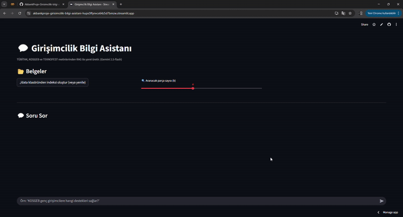

# AkbankProje-Girisimcilik-bilgi-asistani
  TÜBİTAK, KOSGEB ve TEKNOFEST verilerini kullanarak öğrenci girişimcilere hibe ve destekler hakkında bilgi veren, RAG tabanlı bir chatbot projesidir.

## 🚀 Projenin Amacı

  Bu projenin temel amacı, 'TÜBİTAK, KOSGEB ve TEKNOFEST' gibi önemli ulusal kaynaklardan edinilen bilgilerle donatılmış bir "Girişimcilik Bilgi Asistanı" oluşturmaktır.

-  Geliştirilen bu RAG tabanlı chatbot, özellikle üniversite öğrencileri ve genç girişimcilerin, hibe programları, başvuru süreçleri, yarışmalar ve diğer destekler hakkında hızlı ve doğru bilgilere ulaşmasını sağlamayı hedeflemektedir.
-  Bu sayede, karmaşık ve dağınık bilgilerin tek bir arayüzde toplanması ve kullanıcıların sorularına anında yanıt verilmesi amaçlanmıştır.

---

## 📊 Veri Seti Hakkında Bilgi

Projede kullanılan veri seti, üç ana kaynaktan manuel olarak toplanmıştır:

- [TÜBİTAK](https://www.tubitak.gov.tr/)
- [KOSGEB](https://www.kosgeb.gov.tr/)
- [TEKNOFEST](https://www.teknofest.org/)

Bu kurumların web sitelerinde yer alan **hibe, destek ve başvuru süreçleriyle** ilgili içerikler  
elle kopyalanarak `.txt` dosyalarına aktarılmıştır.  
Toplanan metinler şunlardır:

```
data/
├── kosgeb.txt
├── tubitak.txt
└── teknofest.txt
```

---

## 🛠️ Kullanılan Yöntemler ve Çözüm Mimarisi

Proje, veriye dayalı yanıt üretmek için **RAG (Retrieval-Augmented Generation)** mimarisiyle geliştirilmiştir.

**Kullanılan Teknolojiler:**

| Bileşen | Açıklama |
|----------|-----------|
| 💬 **LLM (Large Language Model)** | Google **Gemini 2.5 Flash** |
| 🧭 **Embedding Model** | `intfloat/multilingual-e5-small` |
| 🧮 **Veri Tabanı** | **ChromaDB** (vektör veritabanı) |
| 🌐 **Arayüz** | **Streamlit** |
| 💻 **Dil** | Python 3.10+ |

---

## 🧱 Proje Yapısı
```
AkbankProje-Girisimcilik-bilgi-asistani/
├── data/
│ ├── kosgeb.txt
│ ├── tubitak.txt
│ └── teknofest.txt
├── project.py # Ana uygulama dosyası
├── requirements.txt # Python bağımlılıkları
├── demo.gif # Uygulama tanıtım GIF'i
└── README.md # Proje açıklama dosyası
```

---

### "RAG Mimarisi Adımları"

1. Metin Parçalama ve Vektörleştirme: Toplanan `.txt` dosyaları parçalara ayrılır ve açık kaynaklı bir 'Embedding Modeli' kullanılarak sayısal vektörlere dönüştürülür.
2. Depolama: Vektörler, hızlı arama için 'ChromaDB' Vektör Veritabanı'nda depolanır.
3. Sorgulama: Kullanıcıdan gelen soru vektörleştirilir ve ChromaDB'de en benzer metin parçalarını bulmak için kullanılır.
4. Cevap Üretme: En alakalı metin parçaları, bağlam (context) olarak 'Google'ın Gemini API'si' (Generation Model) tarafından kullanılır ve nihai, bilgilendirici cevap oluşturulur.

---

## 🌼 Kurulum

### 🧱 Sanal Ortam (Virtual Environment) Oluşturmak

```
python -m venv env
env\Scripts\activate   # Windows için

```
### 📦 Gerekli kütüphanelerin yüklenmesi
```
pip install -r requirements.txt
```

🧩 Bu işlem şu temel kütüphaneleri yükleyecektir:
streamlit
chromadb
google-generativeai
sentence-transformers
langchain

--- 

### "Kullanılan Teknolojiler"

-  RAG Pipeline Framework: LangChain
-  Generation Model (LLM): Google Gemini API
-  Embedding Model: Açık kaynaklı bir embedding modeli (örneğin: `sentence-transformers` ailesinden)
-  Vektör Veritabanı: ChromaDB

---

## ✅ Elde Edilen Sonuçlar

Geliştirilen "Girişimcilik Bilgi Asistanı" projesi, belirtilen kurumların destek programları hakkında doğru ve hızlı yanıtlar verebilme yeteneği göstermiştir.
-  Yapılan testlerde, kullanıcıların hibe şartları, başvuru tarihleri ve süreçleri gibi konulardaki sorularına, toplanan veriler ışığında tutarlı ve bilgilendirici cevaplar sunulmuştur.
-  Proje, web arayüzü sayesinde son kullanıcıya kolayca ulaşılabilir hale getirilmiş ve girişimcilik ekosistemine katkı sağlayacak bir bilgi kaynağı olarak tasarlanmıştır.

---

🧭 Test Edin

Aşağıdaki gibi örnek sorularla sistemi test edebilirsiniz:

“KOSGEB genç girişimcilere hangi destekleri sağlar?”
“TÜBİTAK 1512 programına kimler başvurabilir?”
“TEKNOFEST yarışmalarında yaş sınırı var mı?”

---

## 🌐 Web Arayüzü (Deploy Linki)

-  Projenin çalışan web arayüzüne aşağıdaki linkten ulaşabilirsiniz.

    Web Arayüzü Linki: `https://akbankproje-girisimcilik-bilgi-asistani-hupx3ffynvcx64z5d7bmzw.streamlit.app/`
   
## 🎥 Demo
Aşağıdaki GIF, uygulamanın genel çalışma şeklini göstermektedir:

<p align="center">
  
</p>

   
